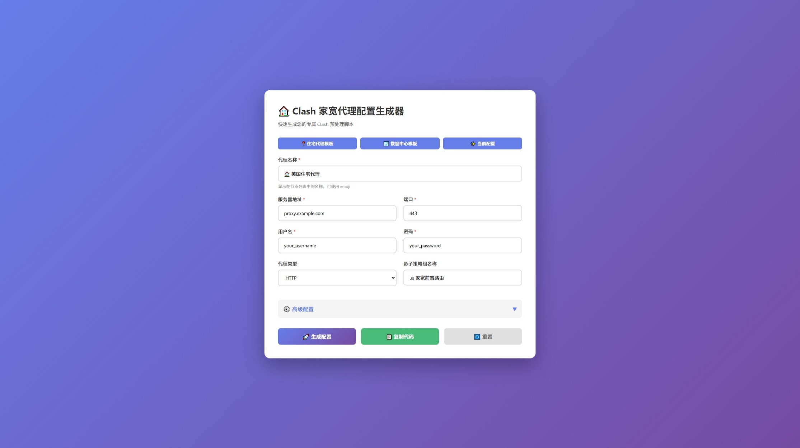

# 🏠 Clash Residential Proxy Parser

<div align="center">

[](https://opensource.org/licenses/MIT)
[](https://github.com/NineThoughts0521/clash-residential-proxy-parser/releases)
[](https://github.com/NineThoughts0521/clash-residential-proxy-parser/stargazers)
[](https://github.com/NineThoughts0521/clash-residential-proxy-parser/pulls)

**为 Clash 订阅添加住宅代理的智能预处理脚本**

[English](./README_EN.md) | 简体中文

[功能特性](#-功能特性) • [快速开始](#-快速开始) • [配置生成器](#️-配置生成器) • [文档](#-文档) • [贡献](#-贡献)

</div>

---

## 📖 项目简介

本项目提供了一套完整的工具链，帮助您轻松为 Clash 订阅配置添加住宅代理（Residential Proxy）节点，并支持灵活的前置路由选择。

### 🎯 解决的问题

- ✅ Netflix、Disney+ 等流媒体服务需要真实住宅 IP
- ✅ ChatGPT、OpenAI 等 AI 服务对数据中心 IP 限制严格
- ✅ 某些网站检测并封禁数据中心 IP
- ✅ 需要更高的匿名性和真实性

### 💡 工作原理

```
┌─────────┐    ┌──────────────┐    ┌──────────────┐    ┌─────────┐
│  您的   │───▶│ 前置路由选择  │───▶│  住宅代理    │───▶│ 目标网站│
│  设备   │    │ (DIRECT/节点) │    │  真实家宽IP   │    │         │
└─────────┘    └──────────────┘    └──────────────┘    └─────────┘
```

**特色功能**：
- 🔄 支持 DIRECT 直连或机场节点作为前置路由
- 🎯 自动添加到 Netflix、AI、YouTube 等策略组
- 🛡️ 防止循环引用和重复添加
- 📝 详细的日志输出
- ⚡ 即插即用，无需修改订阅链接

---

## ✨ 功能特性

### 核心功能

| 功能               | 说明                                         |
| ------------------ | -------------------------------------------- |
| 🏠 **住宅代理支持** | 添加 HTTP/HTTPS/SOCKS5 住宅代理节点          |
| 🔀 **前置路由选择** | 可选择 DIRECT 直连或任意机场节点作为前置     |
| 🎯 **智能策略组**   | 自动添加到 Proxies、Netflix、AI 等常用策略组 |
| 🛡️ **安全防护**     | 防止循环引用、重复添加等问题                 |
| 📊 **日志输出**     | 详细的运行日志，便于调试                     |
| ⚙️ **灵活配置**     | 支持完整版和精简版两种脚本                   |

### 高级特性

- ✅ **幂等性保证** - 多次运行不会产生重复配置
- ✅ **完整校验** - 自动检测配置有效性
- ✅ **兼容性好** - 支持 Clash Premium / Meta (mihomo)
- ✅ **易于扩展** - 清晰的代码结构，方便自定义

---

## 🚀 快速开始

### 方式一：使用配置生成器（推荐）

1. **打开配置生成器**
   ```bash
   # 下载项目
   git clone https://github.com/NineThoughts0521/clash-residential-proxy-parser.git
   cd clash-residential-proxy-parser
   
   # 打开网页生成器
   open tools/config-generator.html  # macOS
   # 或双击打开 tools/config-generator.html
   ```

2. **填写您的代理信息**
   - 服务器地址
   - 端口
   - 用户名
   - 密码

3. **生成并复制脚本**
   - 点击"🚀 生成配置"
   - 点击"📋 复制代码"

4. **配置 Clash 客户端**

   **Clash for Windows / Clash Verge:**
   ```yaml
   parsers:
     - url: https://你的订阅链接
       code: |
         # 在这里粘贴刚才复制的代码
   ```

   **完成！** 更新订阅即可使用

### 方式二：直接使用脚本

1. **下载脚本**
   ```bash
   # 完整版（推荐）
   wget https://raw.githubusercontent.com/NineThoughts0521/clash-residential-proxy-parser/main/scripts/residential_proxy_prepend.js
   
   # 或精简版
   wget https://raw.githubusercontent.com/NineThoughts0521/clash-residential-proxy-parser/main/scripts/residential_proxy_simple.js
   ```

2. **修改配置信息**
   
   编辑脚本中的 `CONFIG` 部分：
   ```javascript
   const CONFIG = {
     residentialProxy: {
       name: "🏠 你的代理名称",
       server: "你的服务器地址",
       port: 你的端口,
       username: "你的用户名",
       password: "你的密码",
       // ...
     }
   };
   ```

3. **添加到 Clash**
   
   将修改后的脚本粘贴到 Parsers 配置中

---

## 🛠️ 配置生成器

本项目提供了 **3 种** 配置生成工具：

### 1. 网页版生成器（最简单）✨

📁 `tools/config-generator.html`

**特点**：
- ✅ 可视化界面，无需编程知识
- ✅ 实时预览生成结果
- ✅ 一键复制，快速部署
- ✅ 支持预设模板

**使用方法**：
```bash
# 直接在浏览器中打开
open tools/config-generator.html
```



### 2. 命令行生成器（批量处理）

📁 `tools/config-generator-cli.js`

**特点**：
- ✅ 交互式命令行界面
- ✅ 支持批量生成
- ✅ 自动保存文件

**使用方法**：
```bash
# 需要 Node.js 环境
node tools/config-generator-cli.js
```

### 3. JSON 模板（配置管理）

📁 `tools/config-template.json`

**特点**：
- ✅ 结构化配置
- ✅ 便于版本控制
- ✅ 支持多配置管理

---

## 📚 文档

### 基础文档

- [快速入门指南](docs/quick-start.md) - 5 分钟上手教程

---

## 🎯 使用场景

### 场景 1：Netflix / Disney+ 流媒体

```
推荐配置：
- 前置路由：DIRECT（直连）
- 适用策略组：Netflix, DisneyPlus, HBO

优势：
✅ 真实住宅 IP，不会被识别为代理
✅ 避免地区限制
✅ 稳定的流媒体播放
```

### 场景 2：ChatGPT / OpenAI

```
推荐配置：
- 前置路由：DIRECT（直连）
- 适用策略组：AI

优势：
✅ 避免数据中心 IP 被封禁
✅ 降低触发风控的概率
✅ 更稳定的 API 访问
```

### 场景 3：隐私保护（双重代理）

```
推荐配置：
- 前置路由：香港/日本节点
- 适用策略组：Proxies, Final

优势：
✅ 双重跳转，增强隐私
✅ 隐藏真实出口 IP
✅ 更高级别的匿名性
```

---

## 🔧 支持的客户端

| 客户端              | 状态 | 说明                  |
| ------------------- | ---- | --------------------- |
| Clash Premium       | ✅    | 完全支持              |
| Clash Meta (mihomo) | ✅    | 完全支持              |
| Clash for Windows   | ✅    | 支持 Parsers 功能     |
| Clash Verge         | ✅    | 支持预处理脚本        |
| Stash (iOS)         | ✅    | 支持 Script 预处理    |
| Clash 开源版        | ⚠️    | 不支持 `dialer-proxy` |

---


## 🤝 贡献

欢迎贡献代码、报告问题或提出建议！

### 贡献方式

1. **Fork 本项目**
2. **创建特性分支** (`git checkout -b feature/AmazingFeature`)
3. **提交更改** (`git commit -m 'Add some AmazingFeature'`)
4. **推送到分支** (`git push origin feature/AmazingFeature`)
5. **提交 Pull Request**

### 报告问题

如果您发现了 bug 或有功能建议，请[提交 Issue](https://github.com/NineThoughts0521/clash-residential-proxy-parser/issues)。

提交 Issue 时请包含：
- 📝 详细的问题描述
- 🔄 复现步骤
- 💻 您的环境信息（系统、Clash 版本等）
- 📋 相关日志（如有）

---

## 💬 社区与支持

- 💬 [GitHub Discussions](https://github.com/NineThoughts0521/clash-residential-proxy-parser/discussions) - 交流讨论
- 🐛 [Issue Tracker](https://github.com/NineThoughts0521/clash-residential-proxy-parser/issues) - 问题反馈
- 📧 Email: ninethoughts0521@outlook.com

---

## 📄 许可证

本项目采用 [MIT License](LICENSE) 开源协议。

```
MIT License

Copyright (c) 2025 Nine Thoughts

Permission is hereby granted, free of charge, to any person obtaining a copy
of this software and associated documentation files...
```

---

## 🌟 Star History

[](https://www.star-history.com/#NineThoughts0521/clash-residential-proxy-parser&type=date&legend=top-left)

---

## 🙏 致谢

感谢以下项目和贡献者：

- Clash - 优秀的代理工具
- Clash Meta - 强大的 Clash 分支

---

## ⚠️ 免责声明

- 本项目仅供学习交流使用
- 请遵守当地法律法规
- 使用本工具产生的任何后果由使用者自行承担
- 作者不对使用本工具造成的任何损失负责

---

<div align="center">

**如果这个项目对您有帮助，请给个 ⭐ Star 支持一下！**

Made with ❤️ by [Nine Thoughts]

</div>
